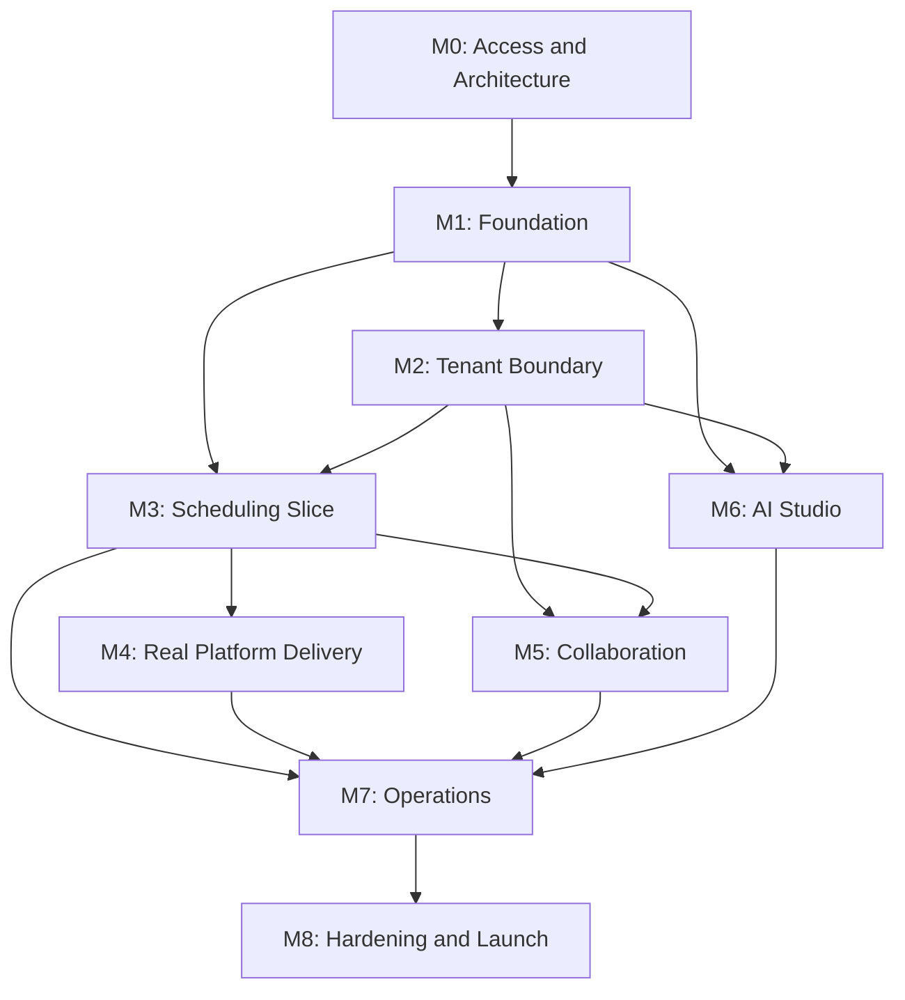

# Pulsea Implementation Backlog

Status: Draft for engineering kickoff
Source: Pulsea PRD v3.0, May 2026
Target stack: Django 5.x, HTMX 2.x, Alpine.js 3.x, Tailwind CSS 3.x, PostgreSQL 16, Celery 5.x, Redis 7, AWS S3

## 1. Purpose

This backlog turns the Pulsea PRD into an implementation sequence for an internal agency platform. It is intentionally organized around testable vertical slices rather than around isolated layers.

The release target remains the PRD V1:

- Operator-controlled content creation, scheduling, and publishing.
- Client portal collaboration without client-side publishing approval gates.
- Five target platforms: Google Business Profile, Facebook, Instagram, TikTok, and YouTube.
- Kenya-first AI assistance for trends, captions, hashtags, and URL-to-post adaptation.
- Reliable background delivery with per-target status, retry behavior, notifications, and operational visibility.

## 2. Delivery Rules

1. External platform access is a delivery dependency, not an assumption. Build adapters against official current API documentation and prove each one with a sandbox or controlled account before marking it complete.
2. Client isolation is a release gate. Every portal feature must ship with negative cross-client authorization tests.
3. Publishing is modeled per target. A post can succeed on one platform and fail on another without hiding either result.
4. AI features assist operators only. AI failures must never prevent composing, editing, scheduling, or publishing a post.
5. Build one end-to-end scheduling path with a fake publisher before connecting real social APIs.
6. Keep platform-specific behavior behind adapters. Views and Celery orchestration must not contain raw platform API logic.

## 3. Recommended Release Boundary

### Production V1

Production V1 includes all P0 items and the P1 items required to make the platform operationally useful:

- Operator and client authentication.
- Strict client data isolation.
- Client, client user, campaign, social account, post, target, and media management.
- Composer with scheduling, media, platform configuration, and per-target status.
- Celery scheduling, publishing, retries, manual retry, and token refresh.
- Facebook, Instagram, GBP, TikTok, and YouTube adapters where platform access has been approved.
- Portal dashboard, campaign view, post detail, comments, asset uploads, and structured content requests.
- Notification center and transactional email.
- AI Studio caption, hashtag, trends, and URL-to-post flows.
- Operator calendar, basic analytics, unified comments inbox, queue slots, and bulk scheduling.
- Production deployment, observability, security review, and end-to-end testing.

### Approval-Contingent Integrations

If GBP or TikTok approval is not available by the release cut, ship their adapters behind feature flags with visible "connection unavailable" states. Do not delay the working Meta and YouTube paths solely for an external approval timeline.

## 4. Product Decisions To Confirm

These decisions should be resolved before or during Milestone 1. Recommended defaults are included so implementation can proceed.

| ID | Decision | Recommended default |
| --- | --- | --- |
| DEC-01 | Aggregate post status after partial target success | Set `Post.status=PUBLISHED` when at least one target publishes and all targets are terminal. Show failed targets prominently. Set `FAILED` only when no target publishes. |
| DEC-02 | Structured request platform selection | A content request can target multiple platforms. Add normalized `ContentRequestTarget` rows instead of a single `ContentRequest.platform` enum. |
| DEC-03 | Client soft-delete semantics | Use deactivation plus `deleted_at`. Retain historical relationships and block portal access for inactive clients. |
| DEC-04 | Media deletion semantics | Add `deleted_at`; hide deleted media immediately and purge S3 objects after 30 days. |
| DEC-05 | First-comment persistence | Store status, error, remote comment ID, and sent timestamp per `PostTarget`. |
| DEC-06 | Analytics persistence | Store timestamped per-target snapshots so trend calculations and 30-day summaries are reproducible. |
| DEC-07 | Audit history | Record post changes, reschedules, retries, and publish transitions in a dedicated audit table. |
| DEC-08 | X trend source availability | Treat X trends as optional behind a provider interface. Verify current API access and ship Google Trends, RSS, and manual trends even if X access is unavailable. |
| DEC-09 | Instagram media delivery | Test whether Meta reliably fetches pre-signed S3 URLs. Add a short-lived public delivery mechanism only if required. |
| DEC-10 | Portal user tenancy | V1 assumes one portal user belongs to exactly one client. Revisit only if one login must access multiple clients. |

## 5. Domain Model Baseline

The PRD checklist says 14 core models, but section 3.1 lists 16. Several specified behaviors also require persistence that is not listed. Plan for the following baseline.

### Core PRD Models

| Model | Notes |
| --- | --- |
| `Client` | Tenant root with industry, slug, logo, active flag, and soft-delete timestamp. |
| `ClientUser` | Maps a Django user to one client. Multiple users may belong to a client. |
| `SocialAccount` | Connected platform account with encrypted tokens, expiry, remote IDs, and active state. |
| `Campaign` | Client-scoped organizational layer with date range, status, and color. |
| `Post` | Shared content, scheduling state, campaign, first-comment body, queue assignment, and clone origin. |
| `PostTarget` | One platform delivery target per social account with independent delivery state and retry data. |
| `PostPlatformConfig` | Validated JSON configuration owned by a `PostTarget`. |
| `Media` | Client-scoped reusable media record with metadata, source, label, and deletion lifecycle. |
| `PostQueue` | Repeating client and account time slot. |
| `PostLabel` | Client-scoped post tag. |
| `PostComment` | Operator and client discussion on a post. |
| `ContentRequest` | Structured client brief linked to an optional campaign and resulting post. |
| `ContentRequestComment` | Discussion on a content request. |
| `UnifiedComment` | Remote platform comment pulled into the operator inbox. |
| `AITrendSuggestion` | Short-lived AI suggestion generated from trend signals. |
| `Notification` | In-app notification record linked to a recipient. |

### Required Supporting Models

| Model | Why it is needed |
| --- | --- |
| `ContentRequestTarget` | Supports the portal requirement to select multiple target platforms per request. |
| `ContentRequestStatusEvent` | Supports the request status history timeline. |
| `PostTargetMetricSnapshot` | Supports 12-hour analytics fetches, summaries, and best-time calculations. |
| `NotificationPreference` | Supports per-user email preference toggles. |
| `PostAuditEntry` | Supports the post detail audit log and operational troubleshooting. |
| `BulkImport` | Supports bulk upload history and confirmation workflow. |
| `BulkImportRow` | Stores per-row validation state and import errors before confirmation. |
| `TrendSignal` | Stores normalized source trends before suggestion generation for deduplication and auditability. |

### Required Fields Missing From The PRD Table

- Add `deleted_at` to `Client` and `Media`.
- Add `first_comment_status`, `first_comment_error`, `first_comment_platform_id`, and `first_comment_sent_at` to `PostTarget`.
- Add `last_synced_at` and connection-health fields to `SocialAccount`.
- Add `relevance_score`, dismissal state, and expiry timestamp to `AITrendSuggestion`.
- Add `metadata_json` where a notification or audit event needs structured context.
- Add uniqueness constraints for client slugs, remote platform IDs where appropriate, and client-scoped label names.

## 6. Milestone Roadmap

| Milestone | Outcome | Exit gate |
| --- | --- | --- |
| M0. Access and Architecture | External accounts, API research, repo conventions, and deployment assumptions are documented. | Approval applications submitted; architecture decisions recorded; local stack boots. |
| M1. Foundation | Django project, database schema, storage abstraction, Celery, and test harness exist. | Migrations apply cleanly; unit tests pass; worker and beat can start. |
| M2. Tenant Boundary | Operator auth, portal auth, client CRUD, client users, campaigns, and isolation controls work. | Cross-client portal access tests return `403` or `404` consistently. |
| M3. Scheduling Slice | Operator can compose, schedule, and publish through a fake adapter with target-level status and retries. | End-to-end test proves draft to scheduled to published and failed retry flows. |
| M4. Real Platform Delivery | OAuth and publishing adapters are connected progressively. | Each approved platform has a controlled-account publish smoke test and token lifecycle test. |
| M5. Collaboration | Client portal, assets, comments, requests, and notifications are usable end to end. | A client can submit input and receive an operator response without gaining publish controls. |
| M6. AI Studio | Trend ingestion and operator-triggered generation flows work without blocking core workflows. | Valid JSON is enforced; failures degrade gracefully; generation actions are auditable. |
| M7. Operations | Calendar, queue, bulk scheduling, unified inbox, and analytics support daily agency work. | Operator can run a representative month of content through staging. |
| M8. Hardening and Launch | Deployment, observability, security, backups, and regression coverage are production-ready. | Launch checklist passes in a production-like environment. |

## 7. Detailed Backlog

Priority meanings:

- `P0`: Required for the usable production V1 path.
- `P1`: Required for V1 operational completeness unless explicitly deferred at release cut.
- `P2`: Valuable optimization after the core workflow is stable.

### Epic A: Access, Research, And Architecture

| ID | Pri | Size | Depends on | Deliverable and acceptance criteria |
| --- | --- | --- | --- | --- |
| ARC-01 | P0 | S | None | Submit GBP API access application. Record owner, submission date, Google Cloud project, and current approval state. |
| ARC-02 | P0 | S | None | Submit TikTok Content Posting API review application. Record owner, submission date, app ID, requested scopes, and approval state. |
| ARC-03 | P0 | S | None | Create Meta developer app plan for Facebook and Instagram. Record required permissions, review requirements, and controlled test accounts. |
| ARC-04 | P0 | S | None | Create Google OAuth plan for GBP and YouTube. Record scopes, redirect URIs, token storage rules, and controlled test accounts. |
| ARC-05 | P0 | S | None | Provision or select AWS S3, Redis, SMTP, PostgreSQL, and Anthropic environments for local, staging, and production use. |
| ARC-06 | P0 | M | None | Verify each platform against current official documentation. Capture endpoint, scopes, rate limits, review gates, media limits, comment support, analytics support, and known gaps in an integration matrix. |
| ARC-07 | P0 | S | None | Write architecture decision records for DEC-01 through DEC-10. Any deviation from recommended defaults is reflected in schema tickets. |
| ARC-08 | P1 | S | ARC-06 | Define feature flags per platform and per optional trend provider. Disabled providers remain visible as unavailable and do not break composer usage. |

### Epic B: Project Foundation

| ID | Pri | Size | Depends on | Deliverable and acceptance criteria |
| --- | --- | --- | --- | --- |
| FND-01 | P0 | M | ARC-07 | Scaffold Django project and apps: `accounts`, `clients`, `campaigns`, `publishing`, `media`, `collaboration`, `notifications`, `ai_studio`, and `integrations`. Settings support local, staging, and production environments. |
| FND-02 | P0 | S | FND-01 | Add PostgreSQL configuration, environment loading, `.env.example`, and secret handling rules. No secrets are committed. |
| FND-03 | P0 | M | FND-01 | Add Docker Compose local services for PostgreSQL and Redis, plus documented startup commands. Django, worker, and beat can connect locally. |
| FND-04 | P0 | M | FND-01 | Configure Celery worker and beat, including a test task and timezone handling for EAT. Scheduled task registration is covered by tests. |
| FND-05 | P0 | M | FND-01, ARC-05 | Configure private S3 storage behind a storage service with client-scoped keys and a local development backend. |
| FND-06 | P0 | S | FND-01 | Configure SMTP backend and base branded HTML email template with a console backend for local development. |
| FND-07 | P0 | S | FND-01 | Add structured logging, request IDs, and redaction filters for tokens and secrets. |
| FND-08 | P0 | M | FND-01 | Set up `pytest`, factories, coverage, linting, formatting, and CI checks. A smoke test runs in CI. |
| FND-09 | P1 | M | FND-01 | Create Ansible baseline for Ubuntu, Gunicorn, Nginx, Redis, Celery worker, Celery beat, FFmpeg, SSL, and service restarts. |

### Epic C: Data Model And Admin

| ID | Pri | Size | Depends on | Deliverable and acceptance criteria |
| --- | --- | --- | --- | --- |
| DAT-01 | P0 | L | FND-02, ARC-07 | Implement core tenant, campaign, social account, post, target, platform config, queue, and label models with migrations and constraints. |
| DAT-02 | P0 | L | DAT-01 | Implement media, comments, requests, request targets, request status events, unified comments, notifications, and preferences with migrations. |
| DAT-03 | P0 | M | DAT-01 | Implement encrypted token fields and tests proving serialized model output, logs, and admin views do not expose raw tokens. |
| DAT-04 | P1 | M | DAT-01 | Implement metric snapshots, post audit entries, bulk import records, bulk import rows, trend signals, and AI suggestions. |
| DAT-05 | P0 | M | DAT-01, DAT-02 | Register operator-useful Django admin pages with list filters, search, read-only timestamps, and safe token handling. |
| DAT-06 | P0 | M | DAT-01 | Implement post aggregate state calculation and legal transition helpers. Tests cover full success, full failure, partial success, archive, and manual retry. |
| DAT-07 | P1 | S | DAT-02 | Implement soft-delete managers for clients and media. Default querysets hide deleted records while historical foreign keys remain intact. |

### Epic D: Authentication, Tenancy, Clients, And Campaigns

| ID | Pri | Size | Depends on | Deliverable and acceptance criteria |
| --- | --- | --- | --- | --- |
| TEN-01 | P0 | M | DAT-01 | Implement operator authentication and staff-only `/operator/` namespace protection. Non-staff users cannot enter operator routes. |
| TEN-02 | P0 | M | DAT-02 | Implement portal login, logout, inactive-client rejection, `ClientMiddleware`, and `ClientRequiredMixin`. |
| TEN-03 | P0 | L | TEN-02 | Add reusable client-scoped queryset helpers and negative tests for campaign, post, media, comment, request, notification, and calendar access. |
| TEN-04 | P0 | M | TEN-01 | Implement operator client list, create, detail, edit, deactivate, and soft-delete flows. |
| TEN-05 | P0 | M | TEN-04, FND-06 | Implement client user invite, reset password, deactivate, and reactivate flows with email instructions. |
| TEN-06 | P0 | M | TEN-04 | Implement campaign create, list, detail, edit, status, archive, and color selection flows. |
| TEN-07 | P1 | S | TEN-02 | Implement client account settings: display name, password change, and email notification preferences. |

### Epic E: Scheduling And Publishing Core

| ID | Pri | Size | Depends on | Deliverable and acceptance criteria |
| --- | --- | --- | --- | --- |
| PUB-01 | P0 | M | DAT-06 | Define `PlatformPublisher` adapter contract for publish, first comment, comments sync, reply, hide, metrics, and token refresh capabilities. Unsupported operations return explicit capability results. |
| PUB-02 | P0 | M | PUB-01 | Implement fake publisher adapter with configurable success, temporary failure, permanent failure, and partial success behavior for development and tests. |
| PUB-03 | P0 | L | PUB-02, TEN-06 | Implement operator composer for client, campaign, title, body, accounts, labels, schedule, publish-now, and first comment. Valid save creates `PostTarget` rows. |
| PUB-04 | P0 | M | PUB-03 | Implement validated platform configuration forms and JSON schemas. Invalid platform config cannot be scheduled. |
| PUB-05 | P0 | M | PUB-02, FND-04 | Implement `enqueue_due_posts` and `dispatch_post` tasks with idempotency and row locking. Duplicate execution must not create duplicate remote posts. |
| PUB-06 | P0 | M | PUB-05 | Implement per-target retry metadata and exponential retry scheduling at 5, 20, and 60 minutes. Exhausted retries notify the operator. |
| PUB-07 | P0 | S | PUB-06 | Implement manual retry action from post detail. It records an audit event and re-dispatches selected failed targets. |
| PUB-08 | P1 | M | PUB-05 | Implement first-comment delivery per supported target with independent failure state and manual retry. First-comment failure never changes main publish success. |
| PUB-09 | P0 | M | PUB-05 | Implement operator post list and post detail with filters, target statuses, errors, platform links, timestamps, and audit events. |
| PUB-10 | P1 | S | PUB-03 | Implement clone action. Clone copies content and configuration, starts as `DRAFT`, and records `is_clone_of`. |
| PUB-11 | P1 | M | PUB-03 | Implement HTMX draft autosave every 30 seconds with optimistic conflict handling and a saved indicator. |
| PUB-12 | P1 | S | PUB-03 | Add character, duration, and media-limit indicators with server-side enforcement. |

### Epic F: Media

| ID | Pri | Size | Depends on | Deliverable and acceptance criteria |
| --- | --- | --- | --- | --- |
| MED-01 | P0 | M | FND-05, DAT-02 | Implement upload service for JPEG, PNG, WebP, MP4, and MOV with MIME validation, size limits, client-scoped keys, metadata, and safe filenames. |
| MED-02 | P0 | M | MED-01 | Generate image thumbnails and extract video metadata. Reject corrupt media with a useful validation message. |
| MED-03 | P0 | M | MED-01, PUB-03 | Add HTMX upload and asset picker to composer. Uploaded and reused media remain scoped to the selected client. |
| MED-04 | P0 | M | MED-01, TEN-03 | Implement portal asset upload with optional note and operator notification. Clients can view but cannot delete uploads. |
| MED-05 | P1 | M | MED-01 | Implement operator media library filters, previews, source badges, storage quota display, URL import, and soft-delete flow. |
| MED-06 | P1 | M | MED-02 | Add FFmpeg frame extraction service and thumbnail offset selection for video targets. |
| MED-07 | P1 | S | MED-01 | Add daily cleanup for temporary delivery objects and 30-day purge for soft-deleted media objects. |

### Epic G: OAuth And Real Platform Adapters

| ID | Pri | Size | Depends on | Deliverable and acceptance criteria |
| --- | --- | --- | --- | --- |
| INT-01 | P0 | M | ARC-06, DAT-03, TEN-04 | Implement social account management UI with connect, reconnect, disconnect, status, expiry warning, and feature-flag states. |
| INT-02 | P0 | M | INT-01 | Implement shared Google OAuth flow with state validation and scope-specific callback handling for GBP and YouTube. |
| INT-03 | P0 | M | INT-02 | Implement GBP location picker and account persistence for multi-location clients. |
| INT-04 | P0 | M | INT-01 | Implement Meta OAuth flow with state validation, Page discovery, Page token storage, and linked Instagram Business or Creator account discovery. |
| INT-05 | P0 | M | INT-01 | Implement TikTok OAuth PKCE flow and token persistence behind a feature flag. |
| INT-06 | P0 | M | INT-02, INT-04, INT-05 | Implement `refresh_expiring_tokens` task with provider-specific refresh behavior and operator notification on failure. |
| INT-07 | P0 | L | INT-03, PUB-01 | Implement GBP publisher for supported standard, event, offer, and CTA posts. Validate one-image limit and unsupported media. |
| INT-08 | P0 | L | INT-04, PUB-01 | Implement Facebook publisher for single image, carousel, and link posts. |
| INT-09 | P0 | L | INT-04, PUB-01 | Implement Instagram publisher for single image and up-to-10-image carousel container flows. |
| INT-10 | P0 | L | INT-05, PUB-01 | Implement TikTok chunked video publisher with init, upload, status polling, config validation, and rate-limit handling. |
| INT-11 | P0 | L | INT-02, PUB-01 | Implement YouTube resumable upload publisher with metadata, privacy, chunk retry, and Shorts classification behavior. |
| INT-12 | P0 | M | INT-07, INT-08, INT-09, INT-10, INT-11 | Add controlled-account smoke test checklist and adapter integration tests using mocked HTTP responses for each provider. |

### Epic H: Client Collaboration And Notifications

| ID | Pri | Size | Depends on | Deliverable and acceptance criteria |
| --- | --- | --- | --- | --- |
| COL-01 | P0 | M | TEN-02, TEN-03, PUB-09 | Implement portal dashboard with active campaigns, upcoming posts, recent publishes, quick stats, and unread notification count. |
| COL-02 | P0 | M | COL-01 | Implement portal campaign list, campaign detail, scoped post cards, and post detail modal without edit, delete, or reschedule controls. |
| COL-03 | P0 | M | COL-02, DAT-02 | Implement post discussion thread for operator and client with HTMX append and unread state. Client comment notifies operator; operator reply notifies client. |
| COL-04 | P0 | L | TEN-03, DAT-02, MED-04 | Implement client request create, list, detail, reference media, platform targets, deadline, status timeline, and discussion thread. |
| COL-05 | P0 | M | COL-04, PUB-03 | Implement operator request inbox, filters, status updates, comments, and create-post-from-request shortcut. Resulting post links back to request. |
| NTF-01 | P0 | M | DAT-02, FND-06 | Implement notification service that writes in-app records and dispatches email according to type and user preference. |
| NTF-02 | P0 | M | NTF-01 | Add operator and portal notification dropdowns, unread badge, history page, mark-read, and mark-all-read actions. |
| NTF-03 | P0 | M | NTF-01 | Add branded transactional templates for publish, failure, comments, assets, requests, token expiry, and request status changes. |
| NTF-04 | P1 | S | NTF-01 | Implement daily unified-comment digest email at 08:00 EAT. |

### Epic I: AI Studio And Kenya-First Trends

| ID | Pri | Size | Depends on | Deliverable and acceptance criteria |
| --- | --- | --- | --- | --- |
| AI-01 | P0 | M | FND-02 | Implement Anthropic client wrapper with timeout, retry-once behavior, structured logging, strict JSON schema validation, and friendly failure messages. |
| AI-02 | P0 | S | AI-01 | Implement shared Kenya context prompt module with tone guardrails and tests for required context injection. |
| AI-03 | P0 | M | AI-01, DAT-04 | Implement `TrendProvider` contract plus Google Trends, Kenyan RSS, and operator-manual providers. Store normalized `TrendSignal` rows and deduplicate them. |
| AI-04 | P1 | M | AI-03, ARC-06 | Implement optional X trend provider behind feature flag if current API access permits it. Absence must not fail trend runs. |
| AI-05 | P0 | M | AI-02, AI-03 | Implement trend scoring, batch suggestion generation per client industry, 72-hour expiry, dismissal, used state, and ready notification. |
| AI-06 | P0 | L | AI-01, TEN-06 | Implement AI Studio trend panel and caption generator with client, topic, platform, tone, and language inputs. Return three selectable variants. |
| AI-07 | P0 | M | AI-01, AI-06 | Implement hashtag generator with per-platform limits and local, industry, and seasonal mix. |
| AI-08 | P1 | M | AI-01, AI-06 | Implement URL-to-post extraction and platform adaptation. Apply URL safety checks, timeouts, content-size limits, and private-network blocking. |
| AI-09 | P1 | S | AI-01, AI-06 | Implement caption rewrite actions: shorter, punchier, CTA, translate, local flavor, and remove jargon. |
| AI-10 | P2 | M | DAT-04 | Implement best-time recommendation using metric history with EAT and industry baselines for clients without sufficient data. |
| AI-11 | P1 | S | AI-03 | Implement scheduled trend fetches, throttling, cleanup, and operator-visible failure logging. |

### Epic J: Agency Operations

| ID | Pri | Size | Depends on | Deliverable and acceptance criteria |
| --- | --- | --- | --- | --- |
| OPS-01 | P1 | L | PUB-09, TEN-06 | Implement operator FullCalendar month, week, and day views with campaign colors, client filter, label filter, event drawer, and unscheduled tray. |
| OPS-02 | P1 | M | OPS-01 | Implement drag-to-reschedule endpoint with authorization, validation, audit entry, and HTMX response. |
| OPS-03 | P1 | M | DAT-01, PUB-05 | Implement queue slot CRUD and 14-day upcoming slot view per client and account. |
| OPS-04 | P1 | M | OPS-03 | Implement `fill_queue_slots`, queue assignment, and drag-to-slot behavior with duplicate-slot protection. |
| OPS-05 | P1 | L | DAT-04, PUB-03, MED-01 | Implement CSV and Excel bulk upload, row validation, preview, confirmation, history, and media URL import. Reject content outside the 30-day import window. |
| OPS-06 | P1 | M | COL-02, OPS-01 | Implement read-only portal calendar with client-scoped events and post detail modal. No mutation endpoints are exposed to portal users. |
| OPS-07 | P1 | L | PUB-01, INT-12, DAT-02 | Implement platform comments sync, unified comments inbox filters, read state, reply, hide where supported, and per-provider capability messaging. |
| OPS-08 | P1 | S | OPS-07, AI-01 | Add operator-reviewed AI spam flagging. Spam suggestions never auto-hide comments. |
| OPS-09 | P1 | L | PUB-01, INT-12, DAT-04 | Implement 12-hour metrics sync and per-target snapshots for supported providers. Show unavailable metrics explicitly. |
| OPS-10 | P1 | M | OPS-09, COL-01 | Add post detail metrics, client 30-day summaries, and best-performing post cards on operator dashboard. |

### Epic K: Hardening, Deployment, And Launch

| ID | Pri | Size | Depends on | Deliverable and acceptance criteria |
| --- | --- | --- | --- | --- |
| REL-01 | P0 | M | FND-09 | Complete staging deploy with Nginx, Gunicorn, Redis, worker, beat, PostgreSQL, S3, SMTP, SSL, and HSTS. Services restart cleanly after reboot. |
| REL-02 | P0 | M | TEN-03, MED-01, INT-12 | Perform security review for tenant isolation, CSRF, OAuth state, token redaction, file validation, pre-signed URLs, temporary public media, SSRF prevention, and rate limits. |
| REL-03 | P0 | M | PUB-05, INT-12 | Add observability for worker failures, queue depth, publish latency, token refresh failures, adapter errors, and beat heartbeat. Alerts identify client, post, and target without exposing secrets. |
| REL-04 | P0 | M | REL-01 | Configure database backups, S3 lifecycle policy, restore runbook, and restore drill. |
| REL-05 | P0 | L | COL-05, AI-07, OPS-10 | Run end-to-end regression suite: compose, schedule, fake publish, real provider smoke publish, client view, comment, request, AI generation, bulk import, retry, and notifications. |
| REL-06 | P1 | M | REL-01 | Run representative load tests for due-post enqueueing, worker concurrency, media upload, calendar feed, and comment sync. Record operating limits. |
| REL-07 | P0 | S | REL-02, REL-03, REL-04, REL-05 | Produce launch runbook with environment checklist, feature flags, rollback procedure, support triage, and external approval states. |

## 8. Dependency Map

## 9. First Engineering Queue

Start with these tickets in order. This queue gets the project to a demonstrable scheduling slice while external approval work proceeds in parallel.

1. `ARC-01` through `ARC-07`: submit approval requests, verify current API assumptions, and lock architecture decisions.
2. `FND-01` through `FND-08`: scaffold the project, local services, storage abstraction, Celery, logging, and CI.
3. `DAT-01` through `DAT-06`: establish the real domain model and state machine.
4. `TEN-01` through `TEN-06`: prove operator and client boundaries before broadening the UI.
5. `PUB-01` and `PUB-02`: create the platform contract and fake publisher.
6. `PUB-03` through `PUB-09`: deliver the first complete draft-to-publish flow.
7. `MED-01` through `MED-04`: add safe media handling and client asset uploads.
8. Begin `INT-01` through `INT-12` as provider approvals and test accounts become available.

The first demo should show:

1. An operator creates a client and campaign.
2. A client user logs into the portal but cannot access another client's records.
3. The operator composes a post with one or more fake targets and schedules it.
4. Celery moves the post through queued and publishing states.
5. One target succeeds and one target fails, making partial success visible.
6. The failed target retries and can be retried manually.
7. The client sees the published post and comments on it.
8. The operator receives a notification and replies.

## 10. Definition Of Done

A ticket is done only when:

- The behavior is implemented with migrations where needed.
- Authorization is enforced server-side.
- Unit or integration tests cover the normal path and meaningful failure paths.
- Tenant-scoped features include a cross-client negative test.
- Background tasks are idempotent or document why they cannot be.
- External API calls use timeouts, bounded retries, and redacted logs.
- Operator-facing failures provide an actionable message.
- Relevant documentation and environment examples are updated.
- CI passes.

## 11. Launch Risks

| Risk | Impact | Mitigation |
| --- | --- | --- |
| GBP API approval delay | GBP publishing may be unavailable at launch. | Apply immediately; isolate provider behind feature flag; ship other providers independently. |
| TikTok review delay or API constraints | TikTok publishing may be unavailable or narrower than planned. | Apply immediately; verify current official API limits; feature-flag adapter; show capability status. |
| Meta media fetch behavior | Instagram container creation may fail against private media URLs. | Test in integration spike; use narrowly scoped temporary delivery objects only if required. |
| X trend API access | X trends may not be available under the selected API tier. | Keep provider optional; ship RSS, Google Trends, and operator manual signals. |
| Duplicate Celery execution | Duplicate remote posts could be published. | Use row locking, idempotency keys where providers support them, audit entries, and replay tests. |
| Cross-client data leakage | High-severity privacy failure. | Centralize scoping helpers; add negative tests for every portal model and endpoint; review before launch. |
| SSRF through URL import and URL-to-post | Internal network exposure or unsafe downloads. | Block private networks, validate schemes, cap redirects, enforce timeouts and size limits. |
| Token exposure in logs or admin | Account compromise. | Encrypt at rest, redact logs, hide admin fields, and test serialization boundaries. |

## 12. Deferred Beyond V1

- LinkedIn and X publishing.
- Facebook and Instagram video or Reels publishing.
- Client-side OAuth connection.
- Client approval gates.
- Advanced analytics dashboards.
- AI-generated images and videos.
- WhatsApp broadcasting, M-Pesa promotion integration, white labeling, PDF reports, and Google Drive imports.
